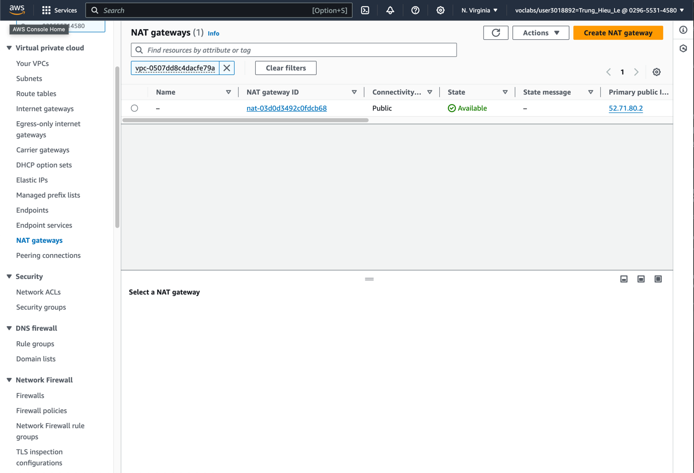
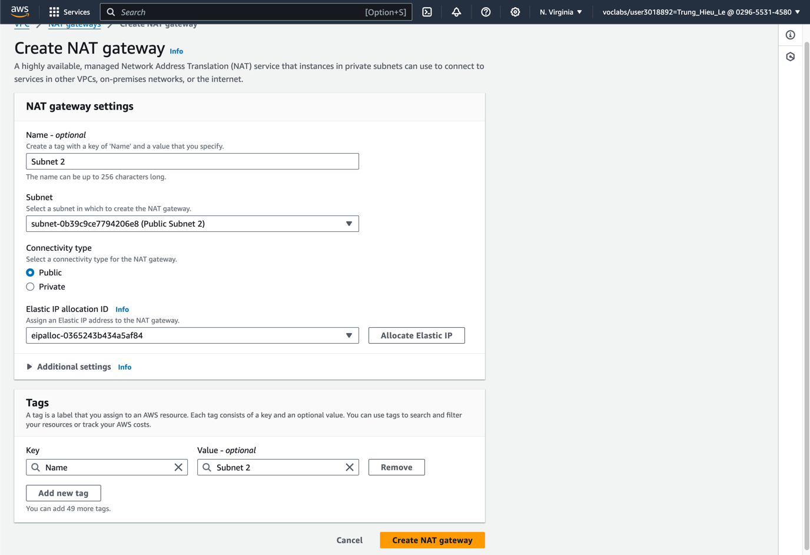
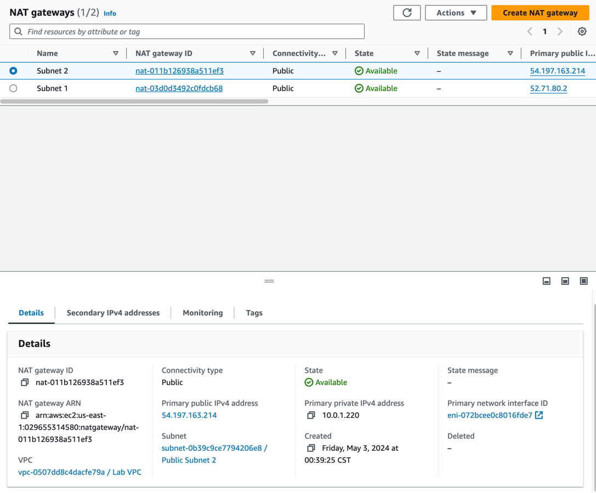
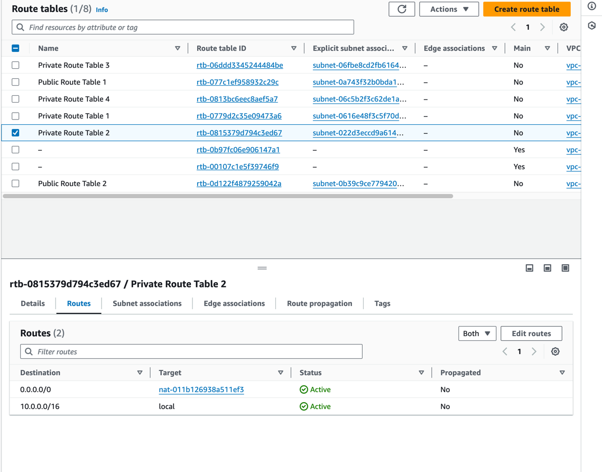

## Scenario

The café will soon be featured in a famous TV food show. When it airs, Sofía and Nikhil anticipate that the café’s web
server will experience a temporary spike in the number of users—perhaps even up to tens of thousands of users.
Currently, the café’s web server is deployed in one Availability Zone, and they are worried that it won’t be able to
handle the expected increase in traffic. They want to ensure that their customers have a great experience when they
visit the website, and that they don’t experience any issues, such as lags or delays in placing orders.

To ensure this experience, the website must be responsive, able to scale both up and down to meet fluctuating customer
demand, and be highly available. Instead of overloading a single server, the architecture must distribute customer order
requests across multiple application servers so it can handle the increase in demand.

In this lab, you will take on the role of Sofía to implement a scalable and highly available architecture for the café's
web application.

## Overview and Objectives

Lab overview and objectives
In this lab, you use Elastic Load Balancing and Amazon EC2 Auto Scaling to create a scalable and highly available
environment on AWS.

After completing this lab, you should be able to:

- Inspect a VPC
- Update a network to work across multiple Availability Zones
- Create an Application Load Balancer
- Create a launch template
- Create an Auto Scaling group
- Test load balancing and automatic scaling

When you start the lab, your architecture will look like the following example:

At the end of this lab, your architecture should look like the following example:

## A business request for the café: Implementing a scalable and highly available environment (Challenge)

### Task 1: Inspect the VPC

In this task, you will inspect the existing VPC and its components, including

- Subnets
- Route tables
- Security groups
- Internet gateways
- NAT gateways
- Network ACLs

### Task 2: Creating a NAT gateway for the second Availability Zone

To achieve high availability, the architecture must span at least two Availability Zones. However, before you launch
Amazon Elastic Compute Cloud (Amazon EC2) instances for your web application servers in the second Availability Zone,
you must create a NAT gateway for them. A NAT gateway will allow instances that do not have a public IP address to
access the internet.

#### Step 8: Create a NAT gateway in the Public Subnet in the second Availability Zone.

To create a NAT gateway do the following:

- Open the Amazon VPC console
  
- Choose NAT gateways in the navigation pane.
- Choose Create NAT gateway.

In the Create NAT gateway dialog box, do the following:

- For Name tag, enter a name for the NAT gateway.
- For Subnet, choose the Public Subnet in the second Availability Zone.
- For Elastic IP allocation ID, click Allocate Elastic IP to allocate a new Elastic IP address.
- Choose Create NAT gateway.
- Wait until the state of the NAT gateway changes to available.
  

#### Step 9: Configure the network to send internet-bound traffic from instances in Private Subnet 2 to the NAT gateway you just created.

What does internet-bound traffic mean? It means that the traffic is destined for the internet. In this case, the traffic
is destined for the internet because the instances in Private Subnet 2 do not have public IP addresses.

To complete this step, do the following:

- Open the Amazon VPC console.
- Choose Route tables in the navigation pane.
  --> What is a route table? A route table contains a set of rules, called routes, that are used to determine where network traffic is directed.
- Choose the route table associated with Private Subnet 2.
- Choose the Routes tab, and then choose Edit routes.
- Choose Add route.
- For Destination, enter 0.0.0.0/0. This is the CIDR block that represents all IPv4 addresses. CIDR is the acronym for Classless Inter-Domain Routing.
- For Target, choose NAT gateway, and then choose the NAT gateway you created in the previous step.
  

### Task 3: Creating a bastion host instance in a public subnet

A bastion host is a special-purpose computer on a network specifically designed and configured to withstand attacks.

#### Step 10: Create an EC2 instance in one of the public subnets.

### Task 4: Creating a launch template

A launch template is a configuration template that an Auto Scaling group uses to launch EC2 instances.

#### Step 11: Create a launch template.

To create a launch template, do the following:

- Open the Amazon EC2 console.
- In the navigation pane, choose Launch templates.
